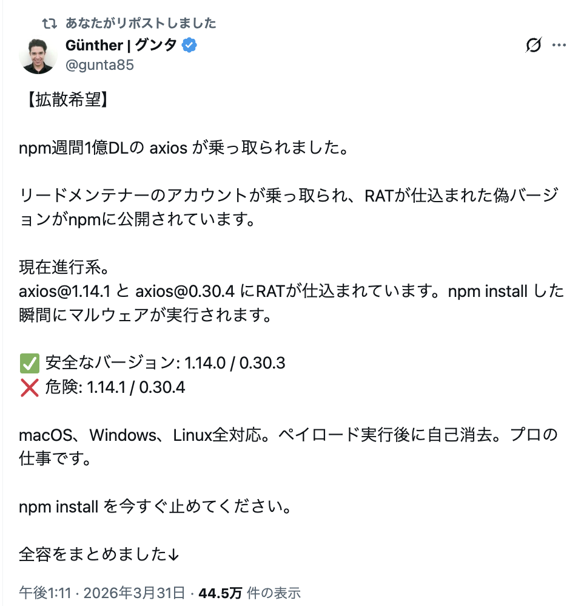

<style>
/* ================================================
   カラーパレット & 基本設定
   ================================================ */
:root {
  --color-primary: #1e3a8a;
  --color-secondary: #3b82f6;
  --color-accent: #60a5fa;
  --color-background: #ffffff;
  --color-surface: #f8fafc;
  --color-text: #1e293b;
  --color-text-light: #64748b;
  --color-border: #e2e8f0;
  --font-default: 'Yu Gothic', 'Hiragino Sans', 'Hiragino Kaku Gothic ProN', 'Meiryo', sans-serif;
  --font-mono: 'Consolas', 'Monaco', 'Courier New', monospace;
}

section {
  background-color: var(--color-background);
  color: var(--color-text);
  font-family: var(--font-default);
  font-weight: 400;
  box-sizing: border-box;
  position: relative;
  line-height: 1.7;
  font-size: 28px;
  padding: 60px 70px;
}

h1, h2, h3, h4, h5, h6 {
  font-weight: 700;
  color: var(--color-primary);
  margin: 0;
  padding: 0;
}

h1 {
  font-size: 60px;
  line-height: 1.3;
  text-align: left;
  margin-bottom: 20px;
}

h2 {
  font-size: 42px;
  padding-bottom: 16px;
  margin-bottom: 40px;
  border-bottom: 3px solid var(--color-primary);
  position: relative;
}

h2::after {
  content: '';
  position: absolute;
  left: 0;
  bottom: -3px;
  width: 80px;
  height: 3px;
  background-color: var(--color-secondary);
}

h3 {
  font-size: 32px;
  color: var(--color-secondary);
  margin-top: 32px;
  margin-bottom: 16px;
  border-left: 5px solid var(--color-secondary);
  padding-left: 16px;
}

h4 {
  font-size: 28px;
  color: var(--color-text);
  margin-top: 24px;
  margin-bottom: 12px;
  font-weight: 600;
}

p {
  margin: 12px 0;
  line-height: 1.8;
}

strong {
  color: var(--color-secondary);
  font-weight: 700;
}

em {
  color: var(--color-accent);
  font-style: normal;
  font-weight: 600;
}

code {
  font-family: var(--font-mono);
  background-color: var(--color-surface);
  padding: 3px 8px;
  border-radius: 4px;
  font-size: 0.9em;
  color: var(--color-secondary);
  border: 1px solid var(--color-border);
}

pre {
  background-color: #2d2d2d;
  color: #ffffff;
  padding: 20px;
  border-radius: 8px;
  overflow-x: auto;
  font-size: 22px;
}

pre code {
  color: #f1f5f9 !important;
  background-color: transparent !important;
  border: none;
  padding: 0;
}

section pre code,
section pre code span,
section pre code *,
section pre code span[style] {
  color: #f1f5f9 !important;
  -webkit-text-fill-color: #f1f5f9 !important;
}

section pre code .hljs-attr,
section pre code .token.property {
  color: #93c5fd !important;
  -webkit-text-fill-color: #93c5fd !important;
}

section pre code .hljs-string,
section pre code .token.string {
  color: #86efac !important;
  -webkit-text-fill-color: #86efac !important;
}

section pre code .hljs-number,
section pre code .hljs-literal,
section pre code .token.number {
  color: #fbbf24 !important;
  -webkit-text-fill-color: #fbbf24 !important;
}

section pre code .hljs-keyword,
section pre code .token.keyword {
  color: #c4b5fd !important;
  -webkit-text-fill-color: #c4b5fd !important;
}

section pre code .hljs-comment,
section pre code .token.comment {
  color: #f9a8a8 !important;
  -webkit-text-fill-color: #f9a8a8 !important;
}

section pre code .hljs-punctuation,
section pre code .token.punctuation {
  color: #cbd5e1 !important;
  -webkit-text-fill-color: #cbd5e1 !important;
}

ul, ol {
  margin: 16px 0;
  padding-left: 32px;
}

li {
  margin-bottom: 12px;
  line-height: 1.7;
}

ul > li {
  list-style: none;
  position: relative;
}

ul > li::before {
  content: '●';
  color: var(--color-secondary);
  font-size: 0.6em;
  position: absolute;
  left: -24px;
  top: 10px;
}

ol > li {
  padding-left: 8px;
}

table {
  width: 100%;
  border-collapse: collapse;
  margin: 24px 0;
  font-size: 24px;
}

th {
  background-color: var(--color-primary);
  color: white !important;
  padding: 14px 16px;
  text-align: left;
  font-weight: 700;
  font-size: 24px;
  border: none;
}

td {
  padding: 14px 16px;
  border-bottom: 1px solid var(--color-border);
  font-size: 24px;
  vertical-align: top;
}

tbody tr:last-child td {
  border-bottom: none;
}

tbody tr:hover {
  background-color: var(--color-surface);
}

/* ================================================
   ページ番号
   ================================================ */
section::after {
  font-size: 20px;
  color: var(--color-text-light);
  position: absolute;
  right: 70px;
  bottom: 24px;
  content: attr(data-marpit-pagination) ' / ' attr(data-marpit-pagination-total);
}

section.lead::after {
  display: none;
}

footer {
  font-size: 0;
  color: transparent;
  position: absolute;
  left: 0;
  right: 0;
  bottom: 0;
  height: 5px;
  background: linear-gradient(to right, var(--color-primary), var(--color-secondary));
}

header {
  font-size: 0;
  color: transparent;
  position: absolute;
  top: 60px;
  right: 70px;
  width: 180px;
  height: 50px;
  opacity: 0.9;
}

section.lead {
  background: linear-gradient(135deg, var(--color-primary) 0%, var(--color-secondary) 100%);
  color: white;
  display: flex;
  flex-direction: column;
  justify-content: center;
  align-items: flex-start;
  padding: 80px 70px;
}

section.lead h1 {
  color: white;
  font-size: 64px;
  margin-bottom: 24px;
}

section.lead p {
  font-size: 26px;
  color: rgba(255, 255, 255, 0.95);
  margin: 6px 0;
  font-weight: 300;
}

section.lead footer,
section.lead header {
  display: none;
}

section.lead strong,
section.lead em,
section.lead code {
  color: white;
  background-color: transparent;
  border: none;
}

.highlight-box {
  background-color: #eff6ff;
  border-left: 5px solid var(--color-secondary);
  padding: 20px 24px;
  margin: 24px 0;
  border-radius: 4px;
}

.success-box {
  background-color: #f0fdf4;
  border-left-color: #10b981;
}

.warning-box {
  background-color: #fffbeb;
  border-left-color: #f59e0b;
}

.error-box {
  background-color: #fef2f2;
  border-left-color: #ef4444;
}

.highlight-box > *:first-child,
.success-box > *:first-child,
.warning-box > *:first-child,
.error-box > *:first-child {
  margin-top: 0;
}

.highlight-box > *:last-child,
.success-box > *:last-child,
.warning-box > *:last-child,
.error-box > *:last-child {
  margin-bottom: 0;
}

.card {
  background: var(--color-background);
  border: 2px solid var(--color-border);
  border-radius: 8px;
  padding: 24px 28px;
  margin: 20px 0;
  box-shadow: 0 2px 4px rgba(0, 0, 0, 0.08);
}

.card h3 {
  margin-top: 0;
  border-left: none;
  padding-left: 0;
}

.card h4 {
  margin-top: 0;
}

.two-columns {
  display: grid;
  grid-template-columns: 1fr 1fr;
  gap: 32px;
  margin: 24px 0;
}

.column {
  background: var(--color-surface);
  padding: 24px;
  border-radius: 6px;
  border: 1px solid var(--color-border);
}

.column h3 {
  margin-top: 0;
  font-size: 30px;
}

.column h4 {
  margin-top: 0;
}

.badge {
  display: inline-block;
  padding: 6px 16px;
  background: var(--color-secondary);
  color: white;
  font-size: 22px;
  font-weight: 600;
  border-radius: 16px;
  margin: 4px 8px 4px 0;
}

.badge-success {
  background: #10b981;
}

.badge-warning {
  background: #f59e0b;
}

.badge-error {
  background: #ef4444;
}

.prompt-box {
  background: #0f172a;
  color: #e2e8f0;
  padding: 22px 24px;
  border-radius: 8px;
  margin: 24px 0;
  border: 1px solid #1e293b;
}

.prompt-box p,
.prompt-box li,
.prompt-box strong {
  color: #e2e8f0;
}

.prompt-box code {
  color: #bfdbfe;
  background: rgba(255, 255, 255, 0.06);
  border: 1px solid rgba(255, 255, 255, 0.12);
}

.step-list {
  display: grid;
  grid-template-columns: repeat(3, 1fr);
  gap: 20px;
  margin: 24px 0;
}

.step-card {
  background: var(--color-surface);
  border: 1px solid var(--color-border);
  border-top: 5px solid var(--color-secondary);
  border-radius: 8px;
  padding: 20px 22px;
}

.step-card h3 {
  margin: 0 0 10px;
  padding-left: 0;
  border-left: none;
  font-size: 28px;
}

.step-card p,
.step-card li {
  margin: 0;
  font-size: 24px;
  line-height: 1.6;
}

blockquote {
  margin: 24px 0;
  padding: 20px 24px;
  background: var(--color-surface);
  border-left: 5px solid var(--color-accent);
  border-radius: 4px;
  font-style: italic;
  color: var(--color-text-light);
}

blockquote p {
  margin: 8px 0;
}

hr {
  border: none;
  height: 2px;
  background: linear-gradient(to right, var(--color-secondary), transparent);
  margin: 32px 0;
}
</style>

<!-- _class: lead -->

# dashcam-permission
# ハンズオン勉強会

AI（Cursor / Claude Code）を使って、クローン・構築・改造まで

2026年4月

---

## 今日やること（全体 約100分）

| パート | 内容 | 目安 |
|---|---|---|
| **導入** | npm install のリスクを知る（axios 事件） | 15分 |
| **ハンズオン①** | AI にセットアップを頼む | 20分 |
| **ハンズオン②** | AI にコードを解説させる＆X API 実行 | 25分 |
| **ハンズオン③** | 管理画面の確認＆エラー対応を AI に任せる | 20分 |
| **ハンズオン④** | AI でコードを改造する | 10分 |
| **まとめ** | 振り返り＆質疑 | 10分 |

<div class="highlight-box">

**ゴール:** AI コーディングツールを使いながら、npm のリスクと X API の使い方を体験する

</div>

---

## 今日の進め方

<div class="step-list">
<div class="step-card">

### 1. まず理解する

- `npm install` が何をしているか知る
- 外部部品のリスク感覚を持つ
- README / package.json の読みどころを掴む

</div>
<div class="step-card">

### 2. 次に動かす

- AI にセットアップを任せる
- `fetch` と `dev` を実行する
- 画面とデータフローを確認する

</div>
<div class="step-card">

### 3. 最後に変える

- エラー対応を AI に任せる
- 小さな改造を1つ入れる
- 「読める・動かせる・直せる」を体験する

</div>
</div>

<div class="highlight-box">

**今日のスタンス:** 全部を理解する必要はない。まずは「どこを見ればよいか」「AI にどう頼めば前に進むか」を持ち帰る。

</div>

---

## 2026年3月31日に何が起きたか

2026年3月31日、**世界中で使われている部品が乗っ取られた。**

- **axios** — 週に1億回ダウンロードされている超人気の部品
- 管理者のアカウントが盗まれ、**偽物にすり替えられた**
- インストールしただけで、**PCが遠隔操作される**ウイルス入り
- Mac / Windows / Linux すべてが対象

<div class="error-box">

**たった1人のアカウントが盗まれただけで、世界中に影響が出た。**
参考: npm 公式セキュリティアドバイザリ / Socket.dev 解析レポート（2026-03-31）

</div>

---

## 実際の警告ポスト（2026年3月31日）

<div class="two-columns">
<div class="column">



</div>
<div class="column">

### 詳細記事

https://zenn.dev/gunta/articles/0152eadf05d173

</div>
</div>

---

## たとえるなら、こういうこと

<div class="two-columns">
<div class="column">

### 普段のイメージ

「公式のアプリストアからダウンロードしたから安全」と思っている

</div>
<div class="column">

### 今回起きたこと

公式ストアの**中の人のアカウント**が乗っ取られて、**見た目そのままの偽アプリ**が配布された

</div>
</div>

<div class="warning-box">

**見た目は同じ。名前も同じ。でも中身が違う。** 気づくのは非常に難しい。

</div>

---

## 身を守るには？

| やること | なぜ大事か |
|---|---|
| **使う部品を最小限にする** | 部品が少ないほどリスクが減る |
| **バージョンを固定する** | 勝手に新しい版に切り替わらない |
| **信頼できるものか確認する** | ダウンロード数や更新履歴を見る |

<div class="highlight-box">

**「便利だから入れる」ではなく「本当に必要か？」を考える習慣が大切。**

</div>

---

## npm install とは

**「部品をまとめてダウンロードするコマンド」**

<div class="two-columns">
<div class="column">

### 料理にたとえると

レシピ（`package.json`）に「卵、砂糖、小麦粉が必要」と書いてある → `npm install` で材料を自動で買い出し

</div>
<div class="column">

### 実際にやっていること

`package.json` に書かれた4つの部品をネットから取得して `node_modules` フォルダに保存する

</div>
</div>

<div class="highlight-box">

**先ほどの axios 事件は、この「買い出し」の仕組みを悪用した攻撃だった。**

</div>

---

## package.json とは — プロジェクトの「設計図」

`npm install` は `package.json` を見て部品をダウンロードする。大きく **2つの情報** が入っている。

```json
{
  "name": "dashcam-permission",
  "scripts": { ... },        // ← コマンドのショートカット集
  "dependencies": { ... }    // ← 必要な外部部品のリスト
}
```

<div class="highlight-box">

**`scripts`** = `npm run ○○` で実行できるコマンドの定義。 **`dependencies`** = ダウンロードする部品の一覧。この2つが核。

</div>

---

## package.json の中身をもう少し見てみよう

<div class="two-columns">
<div class="column">

#### scripts（コマンド定義）

```json
"fetch": "node scripts/fetch-targets.mjs",
"dev": "node server/app.mjs",
"send": "node scripts/send-permission.mjs"
```

`npm run fetch` → 裏で `node scripts/fetch-targets.mjs` が動く

</div>
<div class="column">

#### dependencies（部品リスト）

```json
"better-sqlite3": "^11.0.0",
"dotenv": "^16.4.0",
"express": "^4.21.0",
"twitter-api-v2": "^1.18.2"
```

**たった4つ。** これが全部品。

</div>
</div>

---

## npm パッケージとは — 世界中の人が公開した「部品」

**npmjs.com** という巨大な倉庫サイトに、世界中の開発者が作った部品が**200万個以上**公開されている。

- 誰でも**無料で使える**
- 誰でも**公開できる**
- 「車輪の再発明をしない」ための仕組み

<div class="warning-box">

**誰でも公開できる = 悪意ある部品も混ざりうる。** だから axios 事件のようなことが起きる。

</div>

---

## 「部品を使う」流れ

1. 誰かが便利な機能を作って **npm に公開**
2. 自分の `package.json` に「これ使いたい」と書く
3. `npm install` で**自動ダウンロード**
4. コード内で `import` して使う

```javascript
// 例: express という部品を使って管理画面を作る
import express from "express";
const app = express();
```

<div class="highlight-box">

**ゼロから全部作らなくていい。** 先人が作った部品を組み合わせてツールを作る。それが現代の開発スタイル。

</div>

---

## 今日使うリポジトリは安全？

**今回の勉強会で扱うには、かなり確認しやすい構成です。** 使っている外部部品は **4つ** だけ。

<div class="two-columns">
<div class="column">

### 使っている部品

- **better-sqlite3** — データ保存
- **dotenv** — 設定読み込み
- **express** — 管理画面
- **twitter-api-v2** — X との連携

</div>
<div class="column">

### 確認済みのこと

- 今回問題になった axios は**不使用**
- バージョンは**すべて固定済み**
- 依存関係を**事前確認済み**

</div>
</div>

<div class="success-box">

**重要:** 「絶対安全」ではなく、**依存が少なく中身を追いやすい** から教材として扱いやすい。

</div>

---

## dashcam-permission とは

ドラレコ動画の**使用許可取り**を効率化するローカルツール。

**探す → 選ぶ → 送る → 追う → 整理する** を1つの流れで扱える。

| コマンド | 役割 |
|---|---|
| `npm run fetch` | 候補を集める |
| `npm run dev` | 管理画面を開く |
| `npm run send` | 許可申請を送る |
| `npm run check` | 返事を確認する |
| `npm run export` | 許可済み動画を書き出す |

---

## コマンド全一覧

<div class="two-columns">
<div class="column">

#### メインの流れ

| コマンド | 役割 |
|---|---|
| `npm run fetch` | 候補を集める |
| `npm run dev` | 管理画面を開く |
| `npm run send` | 許可申請を送る |
| `npm run check` | 返事を確認する |
| `npm run export` | 許可済み動画を書き出す |

</div>
<div class="column">

#### 補助・メンテナンス

| コマンド | 役割 |
|---|---|
| `npm run doctor` | 環境チェック |
| `npm run db:init` | DB 初期化 |
| `npm run profiles` | プロフィール補完 |
| `npm run analyze` | 動画解析 |
| `npm run analyze:all` | 全動画を再解析 |
| `npm run backfill:reply-ids` | 返信ID補完 |

</div>
</div>

---

## 技術スタック

<div class="two-columns">
<div class="column">

### アプリ構成

<span class="badge">Node.js</span>
<span class="badge">Express</span>
<span class="badge">SQLite</span>
<span class="badge">twitter-api-v2</span>

ローカル完結。サーバー不要。

</div>
<div class="column">

### 外部ツール

<span class="badge-warning">yt-dlp</span> 動画取得
<span class="badge-warning">ffmpeg</span> 動画処理
<span class="badge-warning">claude CLI</span> 判定補助

`npm run doctor` で不足確認可能

</div>
</div>

---

## yt-dlp とは — 動画ダウンロードツール

X（Twitter）や YouTube などの URL から**動画ファイル（mp4）をダウンロード**するコマンドラインツール。

- X, YouTube, TikTok 等 **1,000以上のサイト**に対応
- URL を渡すだけで動画を保存できる
- `npm install` では入らない（**別途インストール**が必要）

---

## yt-dlp の使われ方

このプロジェクトでは `npm run fetch` の中で**自動的に呼ばれる。**

```bash
yt-dlp "https://x.com/..." -o video.mp4
```

<div class="highlight-box">

**自分で yt-dlp を直接実行する必要はない。** `npm run fetch` が裏で呼んでくれる。ただしインストールされていないと fetch が失敗する。

</div>

---

## ffmpeg / ffprobe とは — 動画処理の万能ツール

<div class="two-columns">
<div class="column">

### ffmpeg

動画の**変換・加工・結合**ができるコマンドラインツール。

このプロジェクトでは `npm run analyze` で動画の解析に使用。

</div>
<div class="column">

### ffprobe

動画の**情報を読み取る**ツール（ffmpeg に同梱）。

- 動画の長さ
- 解像度（1080p 等）
- ファイルサイズ

</div>
</div>

<div class="highlight-box">

**どちらも必須ではない。** `npm run fetch` と `npm run dev` だけなら yt-dlp があれば OK。動画解析まで進めたい場合に必要。

</div>

---

## README.md とは — リポジトリの「説明書」

GitHub でリポジトリを開くと、**最初に表示されるファイル**が `README.md`。

<div class="two-columns">
<div class="column">

### 書いてあること

- このツールは何か
- セットアップ手順
- 使い方（コマンド一覧）
- つまずきやすいポイント

</div>
<div class="column">

### なぜ大事か

- **初めての人が最初に読む**前提で書かれている
- AI に「README を読んでセットアップして」と頼むと、ここを読んで実行してくれる

</div>
</div>

<div class="highlight-box">

**迷ったらまず README を読む。** これはどのリポジトリでも共通のルール。

</div>

---

## リポジトリの中身を覗いてみよう

clone したフォルダには、こんなファイルが入っている:

| ファイル / フォルダ | 役割 |
|---|---|
| `README.md` | プロジェクトの説明書 |
| `package.json` | 必要な部品のリスト＆コマンド定義 |
| `package-lock.json` | 部品のバージョンを完全固定した記録 |
| `.env.example` | 設定ファイルのひな形（APIキーを入れる） |
| `scripts/` | 各コマンドの実体（fetch, send, check 等） |
| `lib/` | 共通の部品（DB接続、API認証、テンプレート等） |
| `server/` | 管理画面のWebサーバー |
| `data/` | 動画やDBの保存先（git には含まない） |

---

## npm run doctor とは — 環境チェックコマンド

`scripts/doctor.mjs` を実行して、**必要なものが揃っているか一括で確認**するコマンド。

<div class="two-columns">
<div class="column">

#### 確認すること

- **環境変数** — `.env` に X API のキー4つが入っているか
- **外部コマンド** — `yt-dlp`、`ffmpeg` 等がインストール済みか

</div>
<div class="column">

#### 出力イメージ

```
OK  X_API_KEY
OK  X_API_SECRET
OK  yt-dlp
NG  ffmpeg  ← 足りない！
```

</div>
</div>

<div class="highlight-box">

**セットアップ後に「何か足りてない？」をすぐ確認できる。** 困ったらまず `npm run doctor`。

</div>

---

## .env とは — 秘密の設定ファイル

API キーやパスワードなど、**コードに直接書きたくない情報**を置くファイル。

<div class="two-columns">
<div class="column">

#### なぜ必要？

- API キーは**自分だけの鍵**
- コードに直接書くと GitHub に公開されてしまう
- `.env` に書けばコードと分離できる

</div>
<div class="column">

#### 仕組み

```
.env（秘密の設定）
  ↓ dotenv が読み込む
コード内で process.env.X_API_KEY として使える
```

</div>
</div>

<div class="warning-box">

**`.env` は Git に含めない設定になっている。** だから `.env.example`（ひな形）だけがリポジトリに入っていて、自分でコピーして中身を埋める。

</div>

---

## では、AI と一緒に動かしてみよう

リスクを「知識」で終わらせず、**AI ツールを使って手を動かして体験する。**

<div class="two-columns">
<div class="column">

### 今日使う AI ツール

- **Cursor** — AI 搭載コードエディタ
- **Claude Code** — ターミナルで動く AI アシスタント

どちらを使っても OK

</div>
<div class="column">

### 4つのハンズオン

1. AI にセットアップを頼む
2. AI にコードを解説させる
3. エラー対応を AI に任せる
4. AI でコードを改造する

</div>
</div>

---

## AI に頼むときの型

雑に「やって」より、**目的・制約・確認方法** を一緒に渡すと精度が上がる。

<div class="prompt-box">

```
README を読んでセットアップして。
やる前に実行予定のコマンドを短く列挙して。
秘密情報は書き換えず、必要なら私に止めて。
終わったら、何が完了して何が未完了か教えて。
```

</div>

---

## AI に頼むときの3要素

<div class="two-columns">
<div class="column">

### 入れると良い要素

- **目的**: 何をしたいか
- **制約**: 触ってほしくないもの
- **確認**: 完了条件

</div>
<div class="column">

### 例

- `.env は自分で埋めるので触らないで`
- `失敗したら原因候補を2つ出して`
- `最後に実行コマンドを一覧で教えて`

</div>
</div>

<div class="highlight-box">

**この3つを意識するだけで、AI の出力品質が大きく変わる。**

</div>

---

## ハンズオン① AI にセットアップを頼む（約20分）

### Step 1: clone だけ自分でやる

```bash
git clone https://github.com/yuzutama/dashcam-permission.git
cd dashcam-permission
```

### Step 2: AI に残りを任せる

Cursor または Claude Code で以下のように頼む:

```
README を読んで、このプロジェクトのセットアップをして。
.env.example をコピーして .env を作って、
doctor で確認して、DB も初期化して。
```

---

## ハンズオン① AI がやってくれること

AI は README を読んで、以下を**自動で実行**してくれる:

| AI が実行するコマンド | やっていること |
|---|---|
| `npm install` | 必要な部品をダウンロード |
| `cp .env.example .env` | 設定ファイルのひな形をコピー |
| `npm run doctor` | 必要なものが揃っているか確認 |
| `npm run db:init` | データを入れる箱（DB）を作成 |

<div class="highlight-box">

**ポイント:** コマンドを覚えなくても、AI が README を読んで適切な手順を判断してくれる。

</div>

---

## ハンズオン① .env の設定

### Step 3: API キーだけは自分で入れる

`.env` を開いて X API の認証情報を入力:

```env
X_API_KEY=あなたのAPIキー
X_API_SECRET=あなたのAPIシークレット
X_ACCESS_TOKEN=あなたのアクセストークン
X_ACCESS_TOKEN_SECRET=あなたのアクセストークンシークレット
```

<div class="warning-box">

**注意:** API キーは X Developer Portal で取得。従量課金プラン（Basic 以上）が必要。
**AI にシークレットキーを渡さないこと。** 自分で `.env` に入力する。

</div>

---

## ハンズオン① doctor で最終確認

### Step 4: AI に確認を頼む

```
環境が正しくセットアップできたか確認して。
npm run doctor を実行して、NGがあれば直して。
```

AI が `npm run doctor` を実行し、NG があれば**原因の特定と修正まで自動でやってくれる。**

---

## ハンズオン① doctor の出力例

```
=== 環境変数 ===
OK  X_API_KEY
OK  X_API_SECRET
OK  X_ACCESS_TOKEN
OK  X_ACCESS_TOKEN_SECRET

=== 必須コマンド ===
OK  yt-dlp    候補収集 (npm run fetch)
```

<div class="success-box">

**全部 OK なら準備完了。** NG が出ても AI に「これ直して」と言えば対処してくれる。

</div>

---

## SQLite とは — ファイル1つで動くDB

**Excel ファイル**に近いイメージ。ファイル1つにデータが全部入っていて、コピーやバックアップもファイルを複製するだけ。

| | MySQL 等 | SQLite |
|---|---|---|
| 起動 | サーバーが必要 | **不要** |
| 設定 | ホスト名・パスワード等 | **なし** |
| データ | サーバー内部に保存 | **ファイル1つ** |

---

## このプロジェクトでの SQLite の使われ方

`data/dashcam.db` というファイル1つに、すべてのデータを保存している。

| 保存しているもの | 内容 |
|---|---|
| 動画候補 | ツイートURL、投稿者、動画パス等 |
| ブロックリスト | 対象外にしたアカウント |
| 送信履歴 | 許可申請の送信状況・返信状況 |

<div class="highlight-box">

**`better-sqlite3`** というnpmパッケージを使って、Node.js から読み書きしている。

</div>

---

## ハンズオン② AI にコードを解説させる（約25分）

### Step 1: fetch スクリプトを AI に聞く

`scripts/fetch-targets.mjs` を開いて、AI に聞いてみよう:

```
このスクリプトは何をしている？
全体の流れを簡潔に説明して。
```

<div class="highlight-box">

**205行のコードを自分で読まなくても、AI が構造と目的を解説してくれる。**
コードの「何」と「なぜ」をすぐに把握できる。

</div>

---

## ハンズオン② 認証コードも聞いてみよう

`lib/twitter-client.mjs` を開いて質問:

```
readOnly って何のため？
これを使わないとどうなる？
```

AI の回答例: 「`readOnly` を使うことで、読み取り専用の API しか呼べなくなる。誤ってツイートを投稿・削除するリスクを防いでいる」

<div class="highlight-box">

**コードの意図や設計判断まで AI に聞ける。** レビュー代わりにもなる。

</div>

---

## ハンズオン② X API を実行する

### Step 2: 実際にデータを取得する

```bash
npm run fetch
```

実行すると、ターミナルに取得状況が表示される。完了まで少し待つ。

---

## ハンズオン② fetch が裏でやっていること

1. 監視対象アカウントの**タイムラインを取得**
2. リプライ先の**元ツイートをたどる**
3. **動画付き投稿**だけを抽出
4. `yt-dlp` で**動画をダウンロード**
5. 投稿情報を **SQLite に保存**

<div class="highlight-box">

**ポイント:** X API v2 + OAuth 1.0a で認証。`twitter-api-v2` ライブラリが認証フローを抽象化。

</div>

---

## ハンズオン② レート制限に注意

X API には**レート制限**がある。制限値はプランやエンドポイントにより異なる。

| エンドポイント | 制限（Basic プラン目安） |
|---|---|
| ユーザータイムライン | 900 リクエスト / 15分 |
| ツイート検索 | 60 リクエスト / 15分 |
| ツイート一括取得 | 300 リクエスト / 15分 |

<div class="warning-box">

**429 エラーが出たら:** 15分待ってから再実行。コード側でも `error.code === 429` をハンドリングしている。
※ 最新の制限値は X Developer Portal で確認してください。

</div>

---

## サーバーとは — リクエストに応える役割のプログラム

<div class="two-columns">
<div class="column">

### 日常のたとえ

**レストランのキッチン**のようなもの。
お客さん（ブラウザ）が「このページを見せて」と注文すると、キッチン（サーバー）が料理（ページ）を作って返す。

</div>
<div class="column">

### このプロジェクトの場合

`npm run dev` を実行すると、**自分のPC内でサーバーが起動**する。

ブラウザが `localhost:3456` にアクセスすると、サーバーが DB からデータを取り出して管理画面を返す。

</div>
</div>

<div class="highlight-box">

**サーバー = 遠くにある特別なコンピュータ、ではない。** 自分の PC でも動く「応答する側のプログラム」のこと。

</div>

---

## localhost とは — 自分のPC自身のアドレス

<div class="two-columns">
<div class="column">

### 普通のWebサイト

ブラウザ → **インターネット上のサーバー**
例: `https://x.com`
世界中の誰でもアクセスできる

</div>
<div class="column">

### localhost

ブラウザ → **自分のPC内部**
例: `http://localhost:3456`
自分だけがアクセスできる

</div>
</div>

<div class="highlight-box">

**`:3456` はポート番号。** PC内の「部屋番号」のようなもの。このツールは3456番の部屋で待機する。

</div>

---

## ハンズオン③ 管理画面を動かす（約20分）

### Step 1: サーバーを起動する

```bash
npm run dev
```

ブラウザで `http://localhost:3456` を開く。

<div class="highlight-box">

**構成:** Express でルーティング → SQLite からデータ取得 → HTML テンプレートで描画

</div>

---

## ハンズオン③ 画面を確認・操作する

<div class="two-columns">
<div class="column">

#### 確認する

- **一覧を確認** — fetch で集めた動画候補が表示されている
- **動画を再生** — 投稿の中身をブラウザ上で確認する
- **投稿者情報を見る** — 元ツイートのリンク・ユーザー名

</div>
<div class="column">

#### 操作する

- **ステータスを変更** — 候補を「送信対象」や「対象外」に分類
- **ブロックリストを確認** — 対象外にしたアカウントの管理

</div>
</div>

---

## ハンズオン③ エラーが出たら AI に聞く

もし途中でエラーが出たら、**エラーメッセージをそのまま AI に貼る。**

```
npm run fetch を実行したらこのエラーが出た:
Error: 429 Too Many Requests
どうすればいい？
```

AI は原因と対処法を教えてくれる:

> 「429 はレート制限エラー。15分待ってから再実行してください」

<div class="highlight-box">

**エラーの意味を調べる手間がなくなる。** .env の設定ミスや PATH の問題も AI に聞けば一発。

</div>

---

## ハンズオン④ AI でコードを改造する（約10分）

### お題A: 許可申請のテンプレートを変えてみよう

`lib/templates.mjs` を開いて AI に頼む:

```
このテンプレートの文面をもっと丁寧な敬語に変えて。
チャンネル名は変えないで。
```

AI が `openers` や `buildRequests` の文面を書き換えてくれる。

<div class="highlight-box">

**34行の小さなファイルだから、変更の影響範囲が見えやすい。** AI の提案を確認して反映するだけ。

</div>

---

## ハンズオン④ もう少し踏み込んだ改造

### お題B: 管理画面に情報を追加してみよう

Cursor または Claude Code で:

```
管理画面の一覧にツイートの投稿日時を表示して。
```

AI が `server/app.mjs` のクエリとテンプレートを修正してくれる。

<div class="success-box">

**「何を変えたいか」を日本語で伝えるだけ。** SQL もHTMLも AI が書いてくれる。
修正後に `npm run dev` で確認すれば、即座に結果が見える。

</div>

---

## 全体のデータフロー

```
X API  ──→  fetch-targets.mjs  ──→  SQLite (dashcam.db)
                  │                        │
                  ↓                        ↓
            data/videos/            server/app.mjs
            (mp4 保存)              (管理画面 :3456)
                                           │
                                           ↓
                                   send / check / export
```

<div class="success-box">

**シンプルな構成。** 依存4つ、スクリプト8本だから AI にも人間にも読みやすい。

</div>

---

## まとめ

<div class="card">

### 今日の持ち帰り

- **npm install は「便利な買い出し」だが、供給元リスクもある**
- **README / package.json / doctor を見れば、初見のリポジトリでも前に進める**
- **AI は「全部おまかせ装置」ではなく、読む・動かす・直すための相棒**
- **小さい実務ツールは、AI 学習の教材としてかなり向いている**
- **大事なのは、何を実行したかを最後に自分で把握すること**

</div>

---

<!-- _class: lead -->

# AI に聞けばコードが読める。
# AI に頼めばコードが書ける。
# でも、何を入れたか理解するのは自分。

dashcam-permission — 依存4つで動く実務ツール
github.com/yuzutama/dashcam-permission
